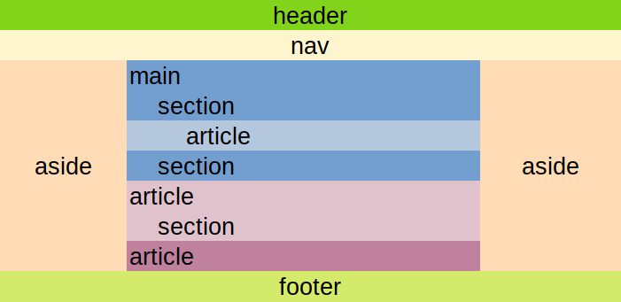

# Tutorial de Html

## Presentación

Revise este link: [https://bit.ly/3b3oCD6](https://bit.ly/3b3oCD6)

### Semantic HTML

Familiarísese con los [elementos semánticos](https://www.w3schools.com/html/html5_semantic_elements.asp)

### Ejemplos

- [Un sitio personal](http://daoc.ml/ejs/EjSite)

## Complementario

Revise este video, contiene otra forma de enfocar el tema: [https://youtu.be/rbuYtrNUxg4](https://youtu.be/rbuYtrNUxg4)
