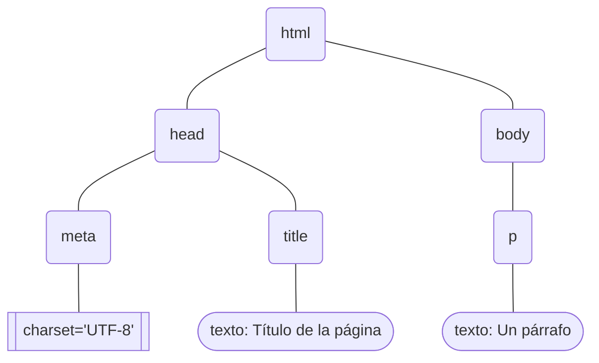

# Tutorial de HTML

HTML o HyperText Markup Language (lenguaje de marcado para hipertexto) define una manera para codificar y estructurar un documento que se usará como una página web. Html es el lenguaje en el que la gran mayoría de los sitios web están definidos en la actualidad.

Un lenguaje de marcado permite definir el contenido y la estructura de la información en un documento mediante elementos organizados en un árbol. Estos elementos están formados de etiquetas o *marcas* que delimitan el contenido del elemento (entre otras cosas). Un elemento puede tener como contenido otros elementos, siempre formando un árbol. A continuación un ejemplo de un documento html muy simple pero completo:

```html
<!DOCTYPE html>

<html>
    <head>
        <meta charset="UTF-8"/>
        <title>Título de página</title>
    </head>
    <body>
        <p>Un párrafo.</p>
    </body>
</html>
```

Las etiquetas que definen los elementos las verá indicadas por los símbolos `< >`, y generalmente vienen en pares, delimitando el elemento: una que indica el inicio y otra el final
-   `<html> ... </html>`, por ejemplo, es el elemento raíz del árbol. Se abre con `<html>` y se cierra con `</html>`.
    - A su interior irán todos los demás elementos del documento formando el árbol
- Muchos elementos contienen texto solamente (en este caso `title` y `p`) y otros pueden tener una combinación de elementos y texto
- Ciertos elementos sin contenido explícito (ni texto ni otros elementos) pueden abrirse y cerrarse en la misma etiqueta con los símbolos `< ... />`.
    - En la etiqueta `meta` tiene un ejemplo.
- Las etiquetas pueden tener también elementos especiales, llamados atributos, que brindan información adicional. Los atributos son pares `clave=valor`, separados por espacios si hay más de uno.
    - En `meta` tiene también un ejemplo de esto con el atributo `charset`.

A continuación una representación del árbol del documento en este ejemplo:


> La etiqueta `<!DOCTYPE html>`, no forma parte del árbol estríctamente. Es lo que se llama una "meta etiqueta", que proporciona información general sobre el documento. En este caso indica que es un documento html.

Se han visto hasta el momento ciertos elementos html de base:

- `html` define la raíz del árbol del documento. Todo el resto de elementos y contenido deberá estar contenido aquí.
- `head` proporciona información general del documento, la cual no se verá en la página web misma pero ayuda a su confuiguración.
- `meta` es una etiqueta genérica que permite brindar configuraciones varias dependiendo de los atributos que utilice. No es una etiqueta requerida, sin embargo en este caso se la usa para especificar el tipo de caracteres que se usarán, gracias al atributo `charset="UTF-8"`.
    - Dado que el texto de la página de ejemplo usa caracteres especiales (tildados), esto garantiza que el browser los renderice correctamente.
- `title` proporciona un título general para la página, el cual se visualizará generalmente en la etiqueta del browser destinada a la página
- `body` define el contenido que se visualizará en la página web.
- `p` es un párrafo. Con este elemento se separan los párrafos (texto generalmente) con un espacio adicional entre ellos.

Mire esta página de ejemplo en su navegador: [EjsBase/simple.html](https://htmlpreview.github.io/?https://github.com/dordonez-ute-apweb/html/blob/main/EjsBase/simple.html)

## Normas o reglas sintácticas

Html es bastante permisivo en cuanto a su sintaxis, y los browsers hacen un gran trabajo interpretando el contenido incluso cuando hay inconsistencias. Sin embargo, hay un par de reglas que conviene tener en cuenta para evitar problemas, especialmente si se trabaja en un ambiente más estructurado como por ejemplo [XHTML](https://es.wikipedia.org/wiki/XHTML).

- Las etiquetas (tag, elemento) deben cerrarse apropiadamente
    - Incorrecto
        - `<p>Ejemplo 1`
        - `<p>Ejemplo 2`
    - Correcto
        - `<p>Ejemplo 1</p>`
        - `<p>Ejemplo 2</p>`
    - Incorrecto
        - `Salto de línea<br>`
    - Correcto
        - `Salto de línea<br/>`
- Etiquetas y atributos deben estar en minúsculas
    - Incorrecto
        - `<P ID="p1">Ejemplo 1</P>`
        - `<P ID="p2">Ejemplo 2</P>`
    - Correcto
        - `<p id="p1">Ejemplo 1</p>`
        - `<p id="p2">Ejemplo 2</p>`
- Valores de atributos deben ir entre comillas, simples o dobles
    - Incorrecto
        - `<p id=p1>Ejemplo 1</p>`
        - `<p id=p2>Ejemplo 2</p>`
    - Correcto
        - `<p id="p1">Ejemplo 1</p>`
        - `<p id='p2'>Ejemplo 2</p>`
- Etiquetas deben estar anidadas correctamente
    - Incorrecto
        - `<p><b>Párrafo 1</p></b>`
        - `<i><p>Párrafo 2</i><p>`
        - `<p><b><i>Párrafo 3</p></i></b>`
    - Correcto
        - `<p><b>Párrafo 1</b></p>`
        - `<p><i>Párrafo 2</i></p>`
        - `<p><b><i>Párrafo 3</i></b></p>`

## Elementos típicos

HTML tiene una infinidad de elementos, unos más usados que otros, dependiendo del tipo de interfaz que generemos. 

Cabe aclarar que html se usa para estructurar, más no para formatear (o diseñar si prefiere). Si desea que su página web se *vea bien*, los elementos de formato se deben incluir usando CSS (Cascading Style Sheets), que se verá más adelante.

Vamos a revisar aquí algunos de los elementos HTML más comunes:

- Comentario
    ```html
    <!-- Comentario en una línea -->
    <!-- Comentario en
      varias líneas -->
    ```
- Párrafo
    ```html
    <p>Párrafo 1</p>
    <p>Párrafo 2</p>
    ```
- Salto de línea (sin separación adicional!)
    ```html
    <p>
    Línea 1<br/>
    Línea 2
    </p>
    ```
- Línea horizontal
    ```html
    <p>Párrafo 1</p>
    <hr/>
    <p>Párrafo 2</p>
    <hr width="50%"/>
    ```
- Títulos (Headings)
    ```html
    <body>
        <h1>Nivel 1 Heading</h1>
        <h2>Nivel 2 Heading</h2>
        <h3>Nivel 3 Heading</h3>
        <h4>Nivel 4 Heading</h4>
        <h5>Nivel 5 Heading</h5>
        <h6>Nivel 6 Heading</h6>
    </body>
    ```
- Estilos de fuente
    ```html
    <p>
        <b>Negrita</b><br/>
        <i>Cursiva</i><br/>
        <b><i>Negrita y cursiva</i></b><br/>
        <small>Pequeña</small><br/>
        <big>Grande</big><br/>
        <em>Enfatizada</em><br/>
        <strong>Strong</strong>
    </p>
    ```
- Listas desordenadas (bulleted)
    ```html
    <ul>
        <li>Primera opción</li>
        <li>Segunda opción</li>
    </ul>
    ```
- Listas ordenadas (numbered)
    ```html
    <ol>
        <li>Primera opción</li>
        <li>Segunda opción</li>
    </ol>
    ```
- Imágenes
    ```html
    
    ```
- Tablas
    ```html
    <table>
        <tr>
            <td>Cell A</td>
            <td>Cell B</td>
        </tr>
        <tr>
            <td>Cell C</td>
            <td>Cell D</td>
        </tr>
    <table>
    ```
- Links (hyperlinks)
    - El elemento `a` presenta un hipervínculo con el texto definido como elemento interno (`Ir a...` en el ejemplo) subrayado y en color azul brillante (generalmente, pero se puede cambiar el formato). Si se da click sobre este hipervínculo, el browser cargará la página definida como valor del atributo `href` (`simple.html` en el ejemplo).
        ```html
        <a href="simple.html">Ir a...</a>
        ```
- Bookmarks (marcadores o anclas)
    - El elemento `a`, en conjunto con el atributo `id`, permiten definir un hipervínculo dentro de la misma página. Al dar click en el link la página desplazará su presentación para que se pueda visualizar el elemento con el atributo `id` igual al definido en el atributo `href` del elemento `a`. En `href` se debe definir el marcador con el símbolo `#`.
        ```html
        <p id="par">Un párrafo</p>
        ...
        <a href="#par">Ir a "Un párrafo"</a>
        ```
- División o sección genérica
    - El elemento `div` se usa como un contenedor genérico para definir una sección del documento. `div` no tiene ningún formato ni ocupa espacio en el documento: por defecto no se renderiza. Sin embargo, facilita el posterior formateo y organización mediante CSS
        ```html
        <div id="header">
            <h1>Título</h1>
            <p>Párrafo</p>
        </div>
        <div id="content">
            <h2>Capítulo 1</h2>
            <p>Párrafo</p>
        </div>
        <div id="footer">
            <h4>Copyright</h4>
            <p>Párrafo</p>
        </div>
        ```    
- Style (CSS)
    - El elemento `style` permite incluir instrucciones CSS para formateo, directamente en la página. Este elemento puede únicamente estar dentro de `head`.
        ```html
        <style>
            h1 {color:red;}
            p {color:blue;}
        </style>
        ```
- Link (CSS principalmente!)
    - El elemento `link` permite relacionar la página web con un archivo adicional donde se definan otros elementos. Generalmente es usado para indicar dónde están las instrucciones CSS que formatearán la página. El atributo `rel` indica la relación, y `href` la URL del archivo. Este elemento puede únicamente estar dentro de `head`.
        ```html
        <link rel="stylesheet" href="estilo.css"/>
        ```
- Script (JavaScript)
    - El elemento `script` permite incluir código JavaScript que se cargará y utilizará en la pagina web. Hay dos modos: incluir el código directamente (si no es mucho) o la referencia a un archivo con el código mediante el atributo `src`, y el atributo `defer` (opcional) para que se ejecute solo cuando todo se haya cargado.
        ```html
        <script>
            function mensaje() {
                alert("hola");
                return true;
            }
        </script>

        <script src="codigo.js" defer />
        ```
- Iframe
    - `iframe` permite presentar o incrustar otra página web dentro de la que se está diseñando. Con el atributo `src` se indica la URL de la página que se va a incrustar, y con los atributos `width` y `height` se define el tamaño del "frame" donde se presentará.
        ```html
        <iframe src="otrapagina.html" height="400" width="600" />
        ```    
> Hay muchísimos elementos html que pueden utilizarse. Para revisarlos siga [este link](https://www.w3schools.com/tags/).

## Viewport

Este elemento merece su sección propia dada su importancia en el diseño adaptable. El correcto manejo de esta etiqueta permitirá un mejor renderizado de su página dependiendo del tamaño o resolución de la pantalla en que se presente.

El viewport es el área de la ventana del browser, en la que se puede visualizar contenido. No necesariamente tiene el mismo tamaño de la ventana, y cuando es más grande, el browser proporcionará barras de desplazamiento para poder visualizar todo el contenido.

> Muchos dispositivos móviles renderizan la página en un viewport mucho más grande que la pantalla, y luego lo achican (zoom out) para que se pueda ver todo su contenido en la pantalla. Luego el usuario podrá desplazarse y agrandar las partes que le interesa visualizar en mayor detalle. Esto se usa especialmente con páginas que no han sido diseñadas para móvil, y cuyo contenido resultaría ilisible si se renderiza en un viewport muy pequeño. Sin embargo, esta técnica no es óptima y puede causar otros problemas a su vez.

El viewport es una `meta` etiqueta, de manera que se la incluye dentro de `head`, de la siguiente manera:
```html
...
<head>
    <meta name="viewport" content="..." />
    ...
</head>
...
```
>- El atributo `name` debe llevar el valor `viewport`, y el atributo `content` tendrá una lista con las configuraciones necesarias.

 Una típica etiqueta viewport optimizada para dispositivos móviles, se ve de la siguiente manera:

```html
<meta name="viewport" content="width=device-width, initial-scale=1" />
```

>- El atributo `width` indica el ancho del viewport y puede tener cualqueir valor en pixeles entre 1 y 10000. En este caso, se usa el valor especial `device-width`, que indica que se adopte al ancho de la pantalla del dispositivo.
>- El atributo `initial-scale` indica el zoom inicial, al cargarse la página, que deberá aplicarse al contenido del viewport. El valor puede ir entre 0.1 y 10. El 1 es el valor por defecto, que indica que no hay zoom.

Familiarísese con el [viewport](https://developer.mozilla.org/en-US/docs/Web/HTML/Viewport_meta_tag)

## Elementos semánticos

Los elementos típicos HTML no llevan ninguna información acerca de su contenido. A partir de HTML5 se añadieron elementos que indican el tipo de información que incluyen.

Estos elementos semánticos pueden facilitar la mejor comprensión del contenido de una página web, tanto para desarrolladores, como para programas de análisis automático. Su contenido no es obligatorio pero es muy recomendado.

A continuación algunos de los más relevantes:


- `main` permite incluir la información principal del documento. No debe contener cosas que se repitan en otras páginas, sino contenido único. Internamente puede estar compuesto de secciones y artículos, pero no debe estar dentro de otros elementos semánticos. Es de "primer nivel".
- `section` define una sección (parte o capítulo) de la información en el documento. Generalmente se lo encuentra dentro de  `main`, pero puede ser independiente. Internamente puede estar compuesto de artículos.
- `article` define una parte de información que es independiente del resto: incluso se debería poder mover a otro lado sin afectar la comprensión del todo. Puede estar dentro de `main` o de `section`, y puede estar compuesto de elementos `section`.
- `aside` incluye información que se relaciona de manera indirecta con la información principal: no es tan importante, pero brinda datos adicionales. Es como una nota al costado.
- `nav` define una barra de navegación o un menú. Contiene un set de vínculos de navegación.
- `header` presenta información introductoria general.
- `footer` presenta información de pié de página, por ejemplo con datos de los autores o información de contacto.

Familiarísese con los [elementos semánticos](https://www.w3schools.com/html/html5_semantic_elements.asp)

## Multimedia

Es muy común querer incluir elementos multimedia (además de imágenes) en una página web. Los elementos más usados son `video` y `audio`:

- Con `video` puede incrustar un video en su página. Con los atributos `width` y `height` se especifica el tamaño de la ventana donde se verá el video, y con el atributo `controls` se incluyen controles para play, stop, pause, ... Es necesario indicar la URL y formato de video en los atributos `src` y `type` del elemento interno `source`. 
    ```html
    <video height="400" width="600" controls>
        <source src="mipeli.mp4" type="video/mp4">
    </video>
    ```  
- `audio` puede incrustar un archivo de audio en su página. Con el atributo `controls` se incluyen controles para play, pause y volumen. Es necesario indicar la URL y formato de audio en los atributos `src` y `type` del elemento interno `source`. 
    ```html
    <audio controls>
        <source src="miaudio.mp3" type="audio/mpeg">
    </audio>
    ``` 
[Familiarísese con otras opciones multimedia.](https://www.w3schools.com/html/html_media.asp)

## Formularios

Los formularios permiten recolectar información del usuario, que generalmente es enviada a un programa en el backend o servidor para su procesamiento.

Tal vez los dos elementos más importantes al crear un formulario son `form` e `input`:

- `form` es el contenedor del formulario. Permite indicar cómo y a dónde se enviará la información, y en su interior están los elementos que recolectarán los datos del cliente, generalmente elementos `input`. El elemento `form` se configura mediante atributos, de los cuales el más importante es `action`, donde se indica la URL del programa que recibirá los datos del formulario cuando el cliente los envíe. Por defecto los datos de un formulario se envían utilizndo el método http GET. Si se desea enviar los datos con POST, se debe añadir el atributo `method`. Al enviar la información al servidor, los caracteres se codifican por defecto en el formato `application/x-www-form-urlencoded`. Si se desea cambiar el formato, por ejemplo para enviar archivos, lo cual requiere el formato `multipart/form-data`, se debe usar el atributo `enctype`. Unos ejemplos a continuación:

```html
<form action="programa.php">
    ...
</form>

<form action="programa.php" method="post">
    ...
</form>

<form action="programa.php" method="post" enctype="multipart/form-data">
    ...
</form>
```
>- El primer ejemplo es la forma más sencilla, que envía la información a *programa.php* mediante GET. Hay que recalcar que el receptor indicado en `action` **debe** ser un programa capaz de procesar la información en el servidor, independientemente del lenguaje de programación en que haya sido hecho. En el ejemplo se asume que es un programa PHP.
>- El segundo ejemplo utiliza ahora el método POST. Esta es tal vez la configuración más común de un formulario, dado que lo que se envía por POST va en el cuerpo de la petición y "no se ve".
>   - Lo que se envía por GET se adjunta a la URL de la petición y se verá en la línea de direcciones del browser.
>- El tercer ejemplo es la configuración utilizada **obligatoriamente** para enviar archivos desde el cliente hacia el servidor: hay que hacerlo por POST y con el encodaje multipart/form-data. Si no se lo hace así, el contenido del archivo no será enviado sino sólo su nombre.

- `input` es un elemento genérico, que puede tomar varias formas, para enviar distintos tipos de información en el formulario. Es imprescindible configurarlo con los atributos `type` y `name`.
    - `type` indica la forma o tipo del elemento. Hay una gran variedad de tipos ([revíselos](https://www.w3schools.com/html/html_form_input_types.asp)), pero tal vez los más usados sean `text`, `password`, `radio`, `checkbox` y `submit`
        - `text` permite al usuario digitar un texto pequeño en una sola línea
        - `password` permite ingresar un texto que no se va a visualizar en la pantalla. Es usado, por ejemplo, en formularios de login
            - Atención! al enviar passwords en un formulario es necesario, 1) usar POST, o se verá el password en la línea de dirección del browser y 2) trabajar sobre HTTPS para que el password (todo realmente) vaya cifrado hasta el servidor
        - `radio` es un botón de opción. Suelen ir en grupo, y solo se puede escoger uno de ellos en el grupo. El grupo lo forman todos los elemntos con el mismo `name`.Utiliza además el atributo `value`. 
        - `checkbox` también suele ir en grupos, y permiten escoger varias de las opciones indicadas en el grupo. También utiliza el atributo `value`
        - `submit` es un tipo especial usado para enviar la información del formulario al servidor. Al usarlo se omite el atributo `name`, pero se añade `value`
    - Los datos que se envían al servidor por cada elemento `input`, toman el formato `clave=valor`. `name` permite indicar la clave (el valor será lo que ingresó o seleccionó el usuario). A continuación ciertos ejemplos:

```html
<input type='text' name='test'/>

<input type='password' name='pwd'/>

<input type='radio' name='opt' value='uno'/>
<input type='radio' name='opt' value='dos'/>

<input type='checkbox' name='opt' value='uno'/>
<input type='checkbox' name='opt' value='dos'/>

<input type='submit' value='Enviar'/>
```
>- El primer ejemplo presenta un cuadro donde el usuario puede tipear. Si el usuario escribió "algo", se enviará "test=algo"
>- El ejemplo password es igual que text, pero cuando el usuario tipee, se verán unos círculos o asteriscos en lugar de los caracteres reales. Si el usario escribió "1234", se enviará "pwd=1234"
>- El ejemplo radio, dependiendo de cuál se seleccionó, enviará "opt=uno" o "opt=dos"
>- El ejemplo checkbox permitiría seleccionar las dos casillas. Si es así, se enviará "opt=uno&opt=dos"
>- Finalmente, submit presentará un botón con el texto "Enviar". Al presionarlo, toda la información del formulario será enviada al programa definido en el atributo action del formulario

Hay una gran variedad de alternativas y elementos que pueden usarse en un formulario. [Familiarísese con ellos](https://www.w3schools.com/html/html_forms.asp).

# Otro material

<!--
## Presentación

Revise este link: [https://bit.ly/3b3oCD6](https://bit.ly/3b3oCD6)
-->

### Ejemplos

- [Un sitio personal](http://daoc.ml/ejs/EjSite)

## Complementario

Revise este video. Contiene otro enfoque sobre el mismo tema: [https://youtu.be/rbuYtrNUxg4](https://youtu.be/rbuYtrNUxg4)
